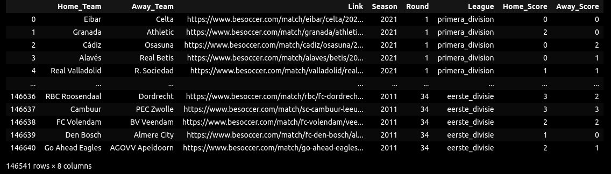

# Football Match Outcome Prediction
## Introduction
### Part I: Historical Data
The Football Match Outcome Prediction project: the user processes a large number of files that contain information about football matches that have taken place since 1990. The data has to be cleaned so it can be fed to the model. Then, different models are trained with the dataset, and the best performing model is selected. The hyperparameters of this model are tuned, so its performance is improved.

Trained Models:
- Logistic Regression
- Random Forest
- Decision Tree
- SVM
- AdaBoost on Decision Tree
- AdaBoost on Logistic Regression
- Gradient Boost
- MLP

CONCLUSION:
The best prediction accuracy results has been obtained through ADABOOST build on Decision Tree model, closely followed by SVM classifier. With scaled data: the stadium capacity features had been scaled to match other features.
The test accuracy score is the same for all sets: 
- AdaBoost on DTree: 49.53%
- SVM : 49.32%

The Random Forest model shows the most overfitting:
- 99% on train vs. 47.55% on test data

The least successful were the models that were fit without scaling. 

After that the resultant DataSet is as follows:
<br>

<br>
The best accuracy scores are shown below:
<br>


### Part II: New test dataset and Prediction
Two models had been trained and saved for future application: 
- AdaBoost on Decision Tree model with max_depth =1: the depth 1 was chosen after the parameter optimization run.
<br>
 
- SVM model 

The similar data preparation and engineering steps have been applied as to the historical data earlier: 
cleaning_data_pipeline_class.py
The outcome of the model application on the new test dataset and prediction outcome is shown on the screenshot below:
<br>


## Table of Contents
* [Results Overview](#results-overview)
* [General Info](#general-information)
* [Technologies Used](#technologies-used)
* [Features](#features)
* [Additional Screenshots](#additional-screenshots)
* [Setup](#setup)
* [Usage](#usage)
* [Project Status](#project-status)
* [Room for Improvement](#room-for-improvement)
* [Acknowledgements](#acknowledgements)
* [Contact](#contact)
<!-- * [License](#license) -->

## Results Overview
- The set of data over 100,000 points is used to create table of features for future model training purposes: Data_Cleaning_Per_League.py
- The obtained cleaned features and their respected outcome are used to train various models to select the most accurate model through carried out analysis: Model_Training.py
- The most accurate model is chosen for future prediction: model_explained.ipynb
- The pipeline is designed to be applied towards avaliable features, this pipeline returns new features.csv files after reading all previous avaliable files and appliying exctly the same data preparation steps as in the development stage: Pipeline/cleaning_data_pipeline.py
- Final model application uses two key models (AdaBoost on Decesion Tree and SVM). The accuracy results on the historical Test sets are: 49.5% and 49.3% respectively and  on the new test data: 48.3% and 47.7%

- In the process of obtaining data Scraper class has been designed with three functional scrapers that are using links provided through the datasets:
1. ELO scraper: scraper that scrapes ELO scores for teams.
2. Match scraper: scraper that scrapes number of Yellow and Red cards given to each team during the game.
3. Results scraper: used in the cleaning_data_pipeline, this scraper obtains game results for those game that have NAN as their results data.

- Finally: the above pipeline and trained models were used to predict the results of the upcoming games.

## General Information
- Problem: given historical football scores data, create model to predict future match outcomes
- Carried out Exploratory Data Analysis to form hypotheses on the dataset.
- Database: processed and cleaned a dataset with more than 100K samples using pandas. Engineered datapoints based on the historical data through cummulative sums (groupby, cumsum and pivot tables), home_team stadium information, each team EOL values.
- Trained various models including tuning parameteres to obtain optimal results and future models inference.
- Evaluated models' accuracy results
- Inference: selected models were further use on the additional test datasets and prediction datasets.

## Technologies Used
- Python
- Pandas
- Seaborn
- Selenium
- Webdriver / Chrome
- SciKit Learn 


## Features
- All information about related links and files are stored in src/config.py file.
- Scraper class uses website: www.besoccer.com . Key features scraper class functions: accept cookies (simple selenium click button action) and cancel subscription prior to scraping (hidden dome layer with java application).

- Model Training/Evaluation included historical set as a whole or per league, as well as decision tree depth index evaluation run.

- Models used: Logistic Regression, Random Forest, Support Vector Machine (SVM), Decision Tree, Gradient Boost and AdaBoost on Decision Tree and Logistic Regression. Features value set is used unmodified for Logistic Regression model training, however for the rest of the model it is scaled and/or piplined through standartisation and normalisation. If the features data set is unscaled, it is failed to converge.


## Additional Screenshots
Score Table after the download and data cleanup/processing.


List of all columns/data in the downloaded scv file


Heatmap shows no NA values in the data set with all features.


Frequency all outcomes for the Home_Team: -1 for Loss, 0 for Draw, 1 for Win.


Overview of the distribution of all features. The plot is used to evaluate gaussian and non-gaussian distribution of data


Correlation matrix between features. The plot shows the most correlation are among hometeam and awayteam data, which is expected as the data repeats at times. 


En example of the cleaned and processed data used for the model training for one of the league, 2_liga.


Sample of the accuracy scores obtined for 2_liga league after the model training.


The sanpshot of the overall accuracy scores for train and test data sets, per each league.


## Setup
matplotlib==3.5.3
numpy==1.22.3
pandas==1.4.2
requests==2.28.0
scikit_learn==1.1.3
seaborn==0.11.2
selenium==3.141.0
setuptools==61.2.0
webdriver_manager==3.8.0


## Usage
Sample of code/data-processing

Upload multiple csv files into one dataframe:
```
#Read all csv files into one pandas df
path = "./Results"
csv_files = glob.glob(path + "/**/*.csv", recursive = True)
results_df = [pd.read_csv(f) for f in csv_files]
pd.set_option('display.max_columns', None)
final_df   = pd.concat(results_df, ignore_index=True)
final_dfs
```

Cleaning Match data - one of the engineering data steps
```
def create_win_draw_loss_data(self):
    """Create Wins/Draws/Losses columns for home and away teams and fill them up with 0 or 1 respective of the outcome"""
    self.features_df[['Home_Wins','Home_Losses','Home_Draws','Away_Wins','Away_Losses','Away_Draws']]=0 
    self.features_df['Home_Wins'] = np.where(self.features_df['Home_Score'] > self.features_df['Away_Score'], 1, self.features_df['Home_Wins'])
    self.features_df['Home_Losses'] = np.where(self.features_df['Home_Score'] < self.features_df['Away_Score'], 1, self.features_df['Home_Losses'])
    self.features_df['Home_Draws'] = np.where(self.features_df['Home_Score'] == self.features_df['Away_Score'], 1, self.features_df['Home_Draws'])
    self.features_df['Away_Wins']=np.where(self.features_df['Home_Score'] < self.features_df['Away_Score'], 1, self.features_df['Away_Wins'])
    self.features_df['Away_Draws']=self.features_df['Home_Draws']
    self.features_df['Away_Losses']= np.where(self.features_df['Home_Score'] > self.features_df['Away_Score'], 1, self.features_df['Away_Losses'])
    self.features_df.reset_index(inplace=True) 
```

ELO score Scraper Code sample
```    
def scraping(self):
for i in range(3): #(len(self.match_link.index)):
    link=str(self.match_link.loc[i, 'Link'])
    print(link)
    self.driver.get(link)
    time.sleep(5)
    self.driver.find_element(By.XPATH, config.ANALYSIS_XPATH).click()
    time.sleep(2)
    home_elo=self.driver.find_element(By.XPATH, config.HOME_ELO_XPATH).text
    away_elo=self.driver.find_element(By.XPATH, config.AWAY_ELO_XPATH).text
    self.match_link.loc[i, ['Home_ELO']]=home_elo
    self.match_link.loc[i, ['Away_ELO']]=away_elo
    time.sleep(2)
self.match_link.to_csv('match_ELO.csv')
```

Model Training Function and application
```
def train_model (X,Y,model):
    """This function applies pre-defined model to the given set of features and outcomes.
    The train/test split is set at 80/20.
    Return accuracy score

    Args:
        X (dataframe): dataset with features (can be scaled, normalised, standardised)
        Y (array or dataframe): outcomes (set of the results)
        model (assigned model from SkLearn): model is assigned prior to application 
    """
    X_train, X_test, y_train, y_test = train_test_split(X, Y, test_size=0.2, random_state=0)
    model.fit(X_train, y_train)
    return(model.score(X_test, y_test))
#LOGISTIC REGRESSION
LR_model=LogisticRegression()
mscore=train_model(X, Y, LR_model)
temp_df=update_dict('All', 'LogReg', mscore)
Models_results = pd.concat([Models_results, temp_df], ignore_index=True)
```


## Project Status
Project is: _complete_


## Room for Improvement

- Apply Neural Network through PyTorch
- Can modify/ upgrade visualisation of the predicted outcomes


## Acknowledgements
- This project was inspired by AiCore training program


## Contact
Created by [@irinawhite](irina.k.white@gmail.com) - feel free to contact me!

